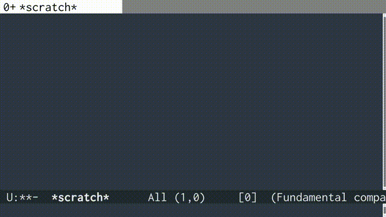

# sushibar.el

Sushibar in Emacs mode-line.  
It's inspired by [pocke/sushibar.vim](https://github.com/pocke/sushibar.vim).

## Demo


## Usage

1. Load sushibar.el.
```
M-x load-file RET sushibar.el RET
```
1. Execute sushibar:setup.
```
M-x sushibar:setup RET
```
